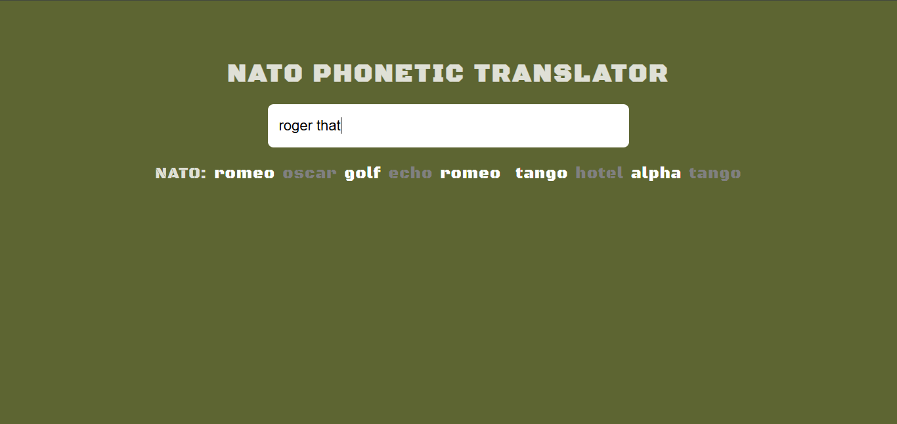

# NATO PHONETIC TRANSLATOR

### Nato Phonetic Translator is a good application that displays the Nato alphabet in real time. Nato alphabet is mainly used in the military setup to ensure the that communication between the members is robust and effective. The Application supports all English words and Symbols like the hash tags and the slash.

## Getting Started 
### The Application handles mainly the ability to translate the Letters typed into the Nato alphabet at an instance.

## Prequisites
### The following technologies are necessary to get the service running
- Any Browser
- An Android Device
- A laptop or any Gadget that can access the internet

## Acknowledgements
### I give thanks to everyone that has contributed to bring thus project to a success and those who will support also in the future. To you all I say thank you.
